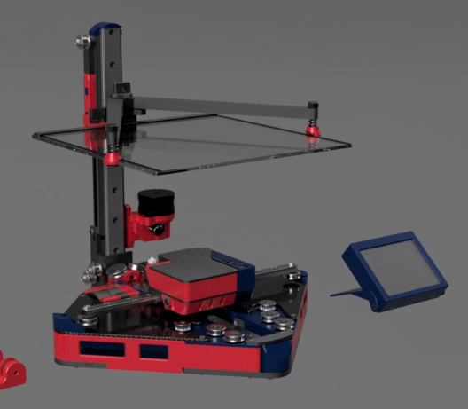

# Positron v3.2 Printed Parts
Hello - all of these folders are what is required to build your Postiron.

In each folder, you will find a readme, this will act as a general Key for the naming of the files, as well as a spot where we've added advisories for some parts. This is as simple as informing you if a part will not be seen from the exterior, if a part will be closely intact with a high temperature item such as a motor, or if a part is recommended to be non-conductive for electrical isolation.

Please note that the folders here are grouped by assembly, and not by recommended order of assembly. Please be sure to follow the guides provided on our wiki.

# Material needed
 - 198.51g for Primary
 - 170.57g for Accent

# Recommended Print Settings

 - We recommend printing all parts in ABS or ASA
 - [We're copying Voron's homework;](https://docs.vorondesign.com/sourcing.html#print-settings)
    - Layer height: 0.2mm
    - Extrusion width: 0.4mm
    - Infill percentage: 40%
    - Infill type: grid, gyroid, honeycomb, triangle, or cubic
    - Wall count: 4
    - Solid top/bottom layers: 5
    - Supports: NONE

ABS or ASA is the recommended filament for most parts, PLA and PETG can be used for accent pieces, but please only do so at your own discretion.

## Important Note
These files are not pre-scaled as modern slicers have a shrinkage factor built in, please be sure to scale your parts accordingly. If you are unsure, try scaling parts by 100.5%

# Example Renders
Below are renders we generated. For reference between "Primary" and "Accent" colors;
 - Primary Colors; Extruder, Panels, Main Hotend Body
 - Accent Colors; Control Panel, Vents, End Caps.
 - Any Colors; Non visible parts that will not be seen in the final build.

# FILE NAME KEY:
`Part Name - Quantity - Recommended Color - Notes`

### Example 1;
`Bed_Cable_Guide - 1x - Accent`  

This is the `Bed_Cable_Guide`, you need to print One of them, recommended in an accent color.

### Example 2;
`Z_PCB_Spacer - 1x - Any - Non-Conductive`

This is the `Z_PCB_Spacer`, you need to print One of them, you can use any color, and must not be conductive.

# Questions or Comments
Please feel free to join our [Discord](https://discord.gg/mGDkYZtyNY) to help with any feedback. We appreciate any and all feedback that can help us better improve our designs.
