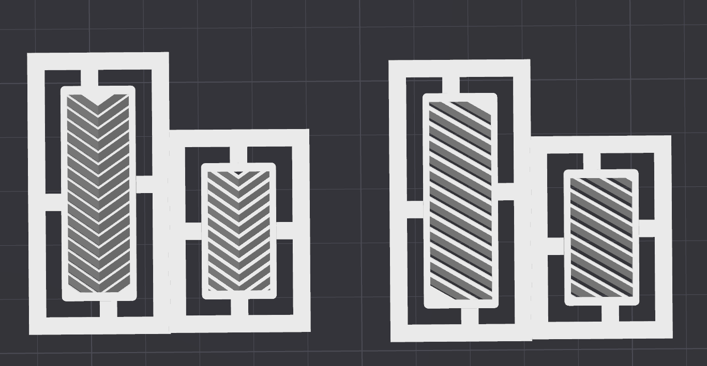

# IMPORTANT FOR THIS FOLDER
The only difference between `Fish_Bone_Grill` and `Slanted_Grill` are the slats in the vent.

`Fish_Bone_Grill` is on the left
`Slanted_Grill` is on the right

# FILE NAME KEY:
`Part Name - Quantity - Recommended Color - Minimum Material Type - Notes`

### Example 1;
`Bed_Cable_Guide - 1x - Accent - PLA`  

This is the `Bed_Cable_Guide`, you need to print One of them, recommended in an accent color, and at the minimum in PLA.

### Example 2;
`Z_PCB_Spacer - 1x - Any - ABSorASA - Non-Conductive`

This is the `Z_PCB_Spacer`, you need to print One of them, you can use any color, at the minimum in ABS or ASA, and must not be conductive.