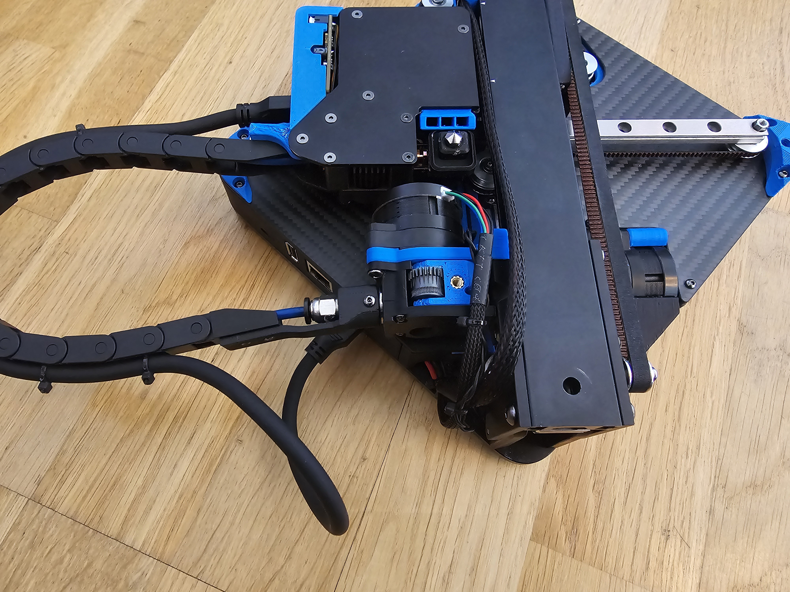

# Swiveling cable chain mod

This mod adds a swiveling attachment to the extruder. This makes it possible to fold the printer
even with the cable chain still attached. The Pelican-style case that the LDO Positron ships with
can also be modified to fit the folded printer with the cable chain sticking out.

## Extra hardware required

  - 2x M2.5 BHCS 6mm bolts
  - 1x MF-148-ZZ bearings (the same type of bearing that is already in the Positron BOM)

## Printing

Print the provided STL file by splitting it into objects and rotating the pieces into the right orientation.

## Assembly

  - Push the plug through the bearing, and attach the arm that will hold the cable chain to the plug using both M2.5 6mm bolts.
  - Take this assembly and slot it into the niche for the bearing into the other two parts.
  - Possibly clear out the filament path using a 2mm drill bit, if there is anything obstructing it.
  - Assemble using the same extruder-side pieces as in the original cable chain mod.

## Photos

Open:

Folded:

